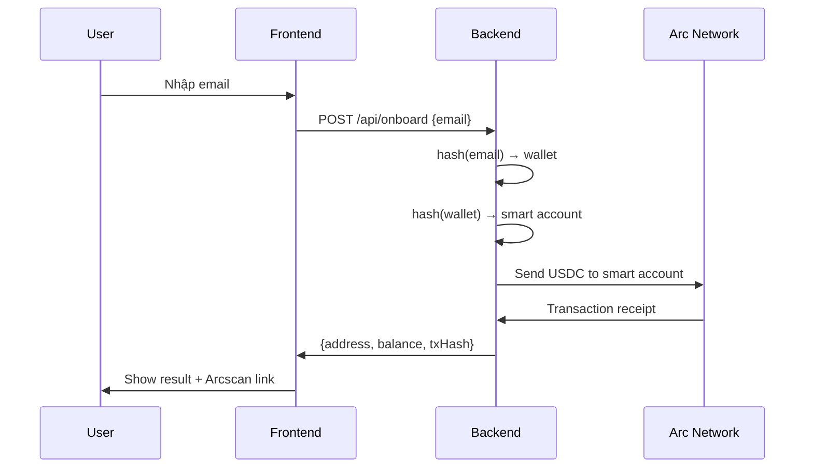

# 📊 Visual Flow

## Email → Smart Account Mapping

```
Email: test@example.com
    ↓
[Hash email với ethers.id()]
    ↓
Private Key: 0xABC123...DEF
    ↓
Wallet Address: 0xWallet123...
    ↓
[Hash wallet address]
    ↓
Smart Account: 0x2126bEeB0f0737885dcfA8dCe54C014E2e477197
```

## Key Concept

**Mỗi email → Một smart account cố định!**

Ví dụ:
- `alice@gmail.com` → Luôn luôn → `0xABC...`
- `bob@gmail.com` → Luôn luôn → `0xDEF...`

**Deterministic = Predictable = Same input → Same output**

## Flow Diagram



## Example Values

**Email:** `test@example.com`

**Step 1: Wallet from email**
```
email = "test@example.com"
hash = ethers.id(email) 
     = "0x8ba1f109551bD432803012645Hac136c22C..." (hash)
wallet = new ethers.Wallet(hash)
       = Address: 0xWallet123...
```

**Step 2: Smart account from wallet**
```
ownerAddress = 0xWallet123...
salt = ethers.id(ownerAddress)
     = "0xdef456..." (hash)
smartAccount = getAddress(salt.slice(0, 20))
             = 0x2126bEeB0f0737885dcfA8dCe54C014E2e477197
```

**Step 3: Transfer USDC**
```
amount = 5.0 USDC
value = parseUnits("5.0", 18)
      = 5000000000000000000 wei (5 * 10^18)

Transaction:
  From: Funder wallet
  To: 0x2126bEeB0f0737885dcfA8dCe54C014E2e477197
  Value: 5000000000000000000 wei
```

## Why This Works

### 1. Deterministic Hashing
```
ethers.id("test@example.com")
→ Always returns same hash
→ Same hash → Same private key
→ Same private key → Same wallet
```

### 2. Consistent Mapping
```
Wallet → Smart Account mapping is consistent
→ Same wallet input → Same smart account output
```

### 3. On Arc
```
Native USDC works like ETH:
  • getBalance(address) returns USDC in wei
  • sendTransaction({to, value}) sends USDC
  • Decimals: 18 for native, 6 for display
```

## Test Yourself

**Try these emails:**
```javascript
email1 = "user1@test.com"
email2 = "user2@test.com"
```

**Result:**
```
user1@test.com → Always → 0xABC...
user2@test.com → Always → 0xDEF...
```

**Same email = Same address every time!**

## Production Upgrade Path

**Current (MVP):**
```
Email → Hash → Wallet → Hash → Smart Account
```

**Future (Production):**
```
Email → Circle Wallets → Secure Keys
                 ↓
        Zerodev SDK → Smart Account
                 ↓
        Pimlico → Paymaster
                 ↓
        Arc Network → Finalized
```

## Smart Account Explanation

**What is a Smart Account?**
- Address controlled by smart contract logic
- Not controlled by private key directly
- Can implement custom rules (multisig, recovery, etc.)

**In this MVP:**
- Smart account = Deterministic address derived from wallet
- No actual smart contract deployed yet
- Just a concept address that could be created

**In production:**
- Smart account = Deployed contract on Arc
- Uses ERC-4337 (Account Abstraction standard)
- Real contract with real logic
- Managed by Zerodev/Biconomy/Dynamic SDKs

---

**TL;DR:** Email → Deterministic hash → Wallet → Deterministic hash → Smart account address → Send USDC to it!

